# DuudlagaFlow

Монгол яриаг бичвэрт хөрвүүлэх macOS програм.

## Суулгах заавар

### 1. DuudlagaFlow програмыг татаж авах

[https://github.com/Tsagaanbayr1/duudlaga-flow/releases](https://github.com/Tsagaanbayr1/duudlaga-flow/releases) холбоос руу орж, хамгийн сүүлийн хувилбарын **Assets** хэсгээс `DuudlagaFlow.dmg` файлыг татаж авна.

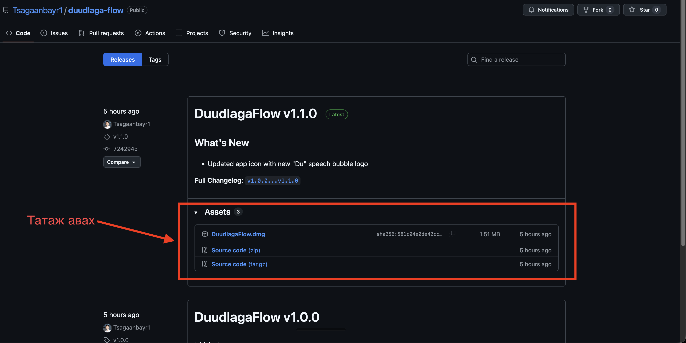

---

### 2. Програмыг Applications хавтас руу зөөх

Татаж авсан `.dmg` файлыг нээгээд, **DuudlagaFlow** програмыг **Applications** хавтас руу чирж зөөнө.

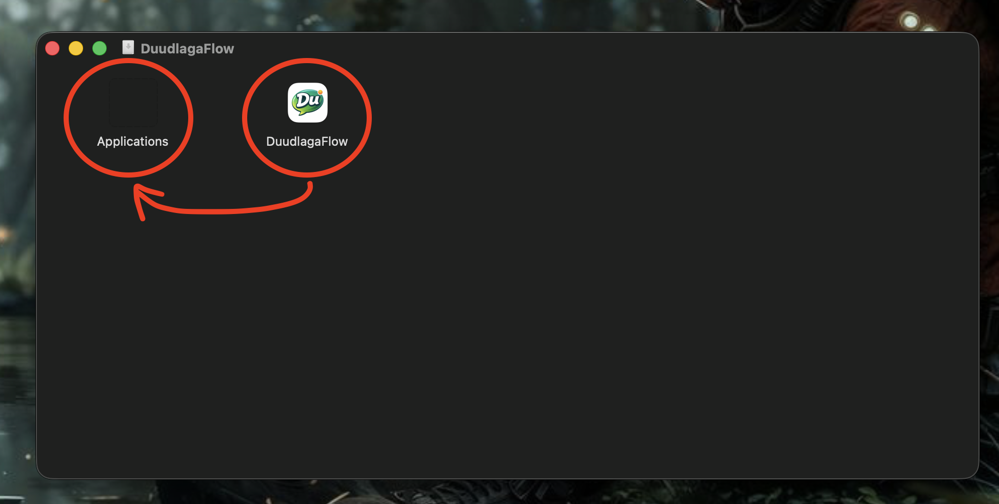

---

### 3. Програмыг нээх

Applications хавтаснаас DuudlagaFlow програмыг нээнэ. Хэрэв аюулгүй байдлын анхааруулга гарвал **Done** товчийг дарна.

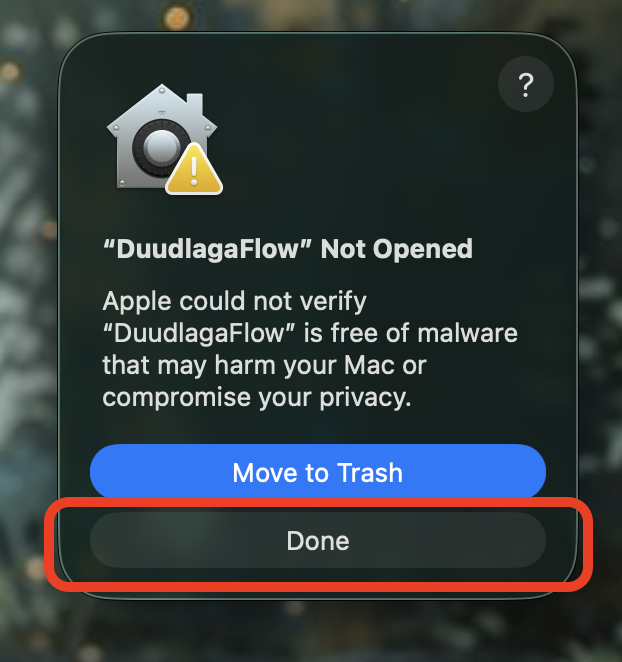

---

### 4. Privacy & Security тохиргооноос зөвшөөрөх

**System Settings** → **Privacy & Security** хэсэг рүү ороод, доод талд байрлах "DuudlagaFlow" was blocked гэсэн мэдээллийн хажууд байгаа **Open Anyway** товчийг дарна.

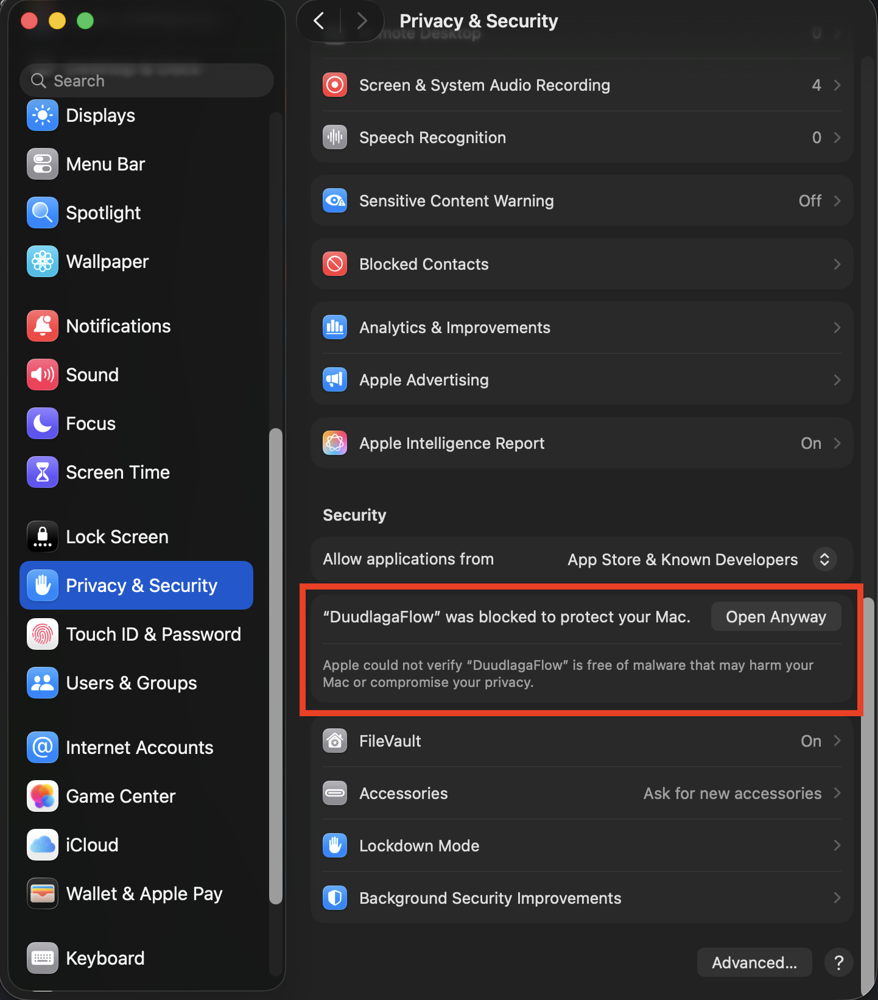

---

### 5. Дахин Open Anyway дарах

Дахин нэг удаа баталгаажуулах цонх гарч ирнэ. **Open Anyway** товчийг дарна.

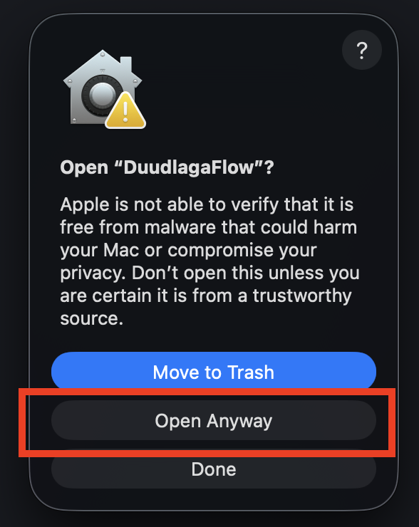

---

### 6. Микрофоны зөвшөөрөл олгох

DuudlagaFlow програм микрофон ашиглах зөвшөөрөл хүснэ. **Allow** товчийг дарж зөвшөөрнө.

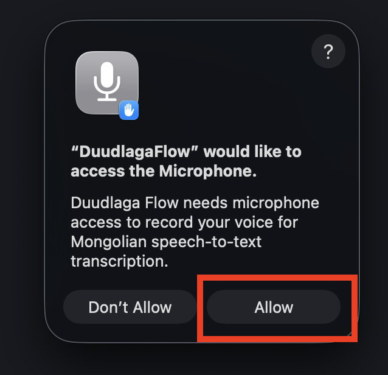

---

### 7. Chimege Console-д нэвтрэх

[https://console.chimege.com/](https://console.chimege.com/) холбоос руу орж, бүртгүүлэн нэвтэрнэ. Дараа нь **"Урьдчилсан төлбөрт"** табыг сонгоод, **"Үйлчилгээ авах"** товчийг дарна.

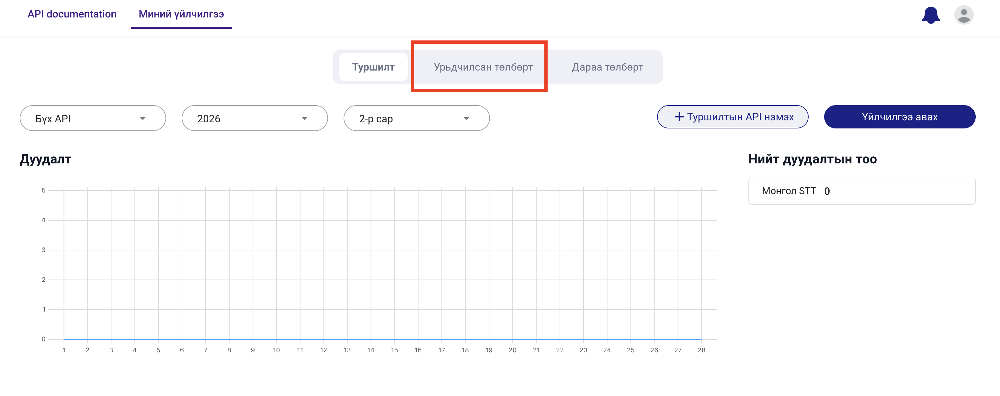

---

### 8. API сонгох

**"Яриаг бичвэрт хөрвүүлэх"** үйлчилгээг сонгоно. Зориулалтаа оруулаад **"Үргэлжлүүлэх"** товчийг дарна.

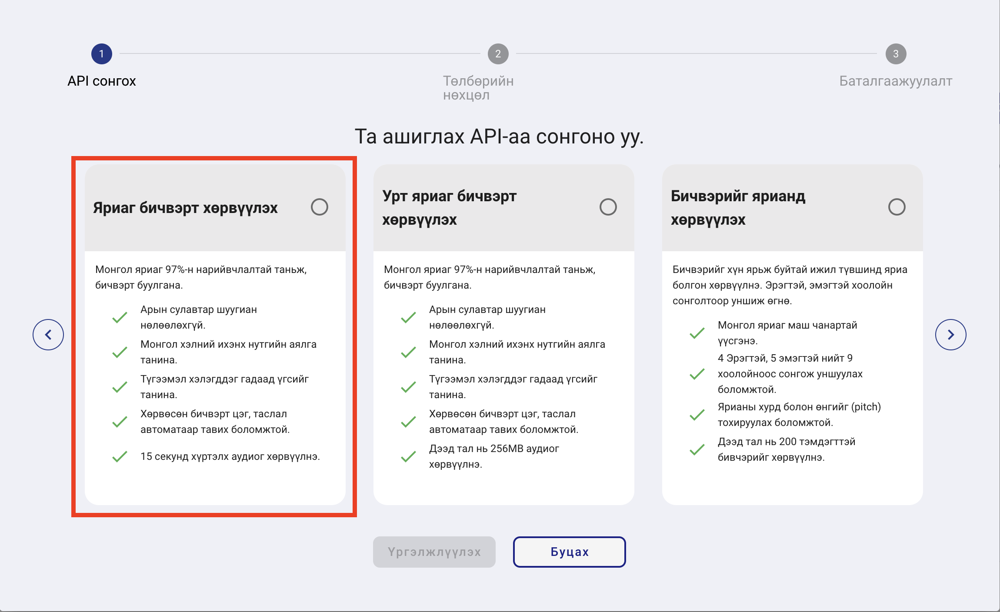

---

### 9. Төлбөрийн нөхцөл сонгох

**"Урьдчилсан төлбөр"**-ийг сонгоод **"Үргэлжлүүлэх"** товчийг дарна.

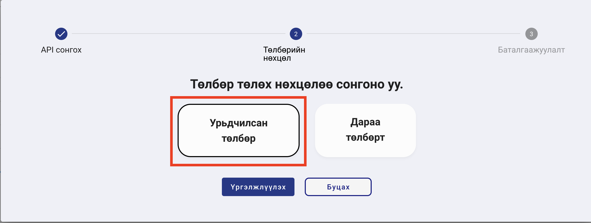

---

### 10. Төлбөр төлөх

Дуудалтын тоогоо оруулж, нийт үнийг шалгана. Үйлчилгээний нөхцөлийг зөвшөөрч чагтлаад **"Төлбөр төлөх"** товчийг дарна.

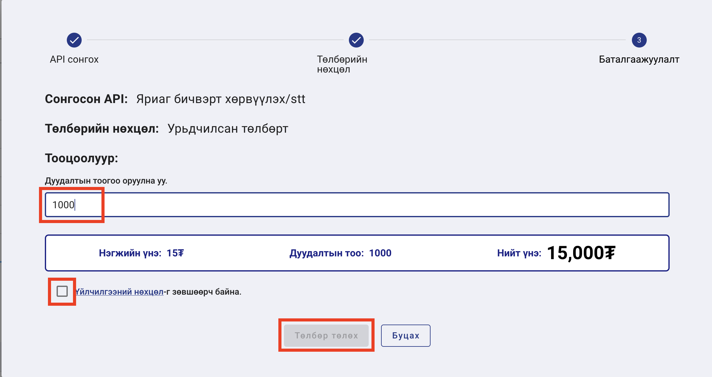

---

### 11. API түлхүүр хуулах

Төлбөр амжилттай хийгдсэний дараа, API жагсаалтаас өөрийн токены хажууд байрлах хуулах товчийг дарж API түлхүүрийг хуулна.

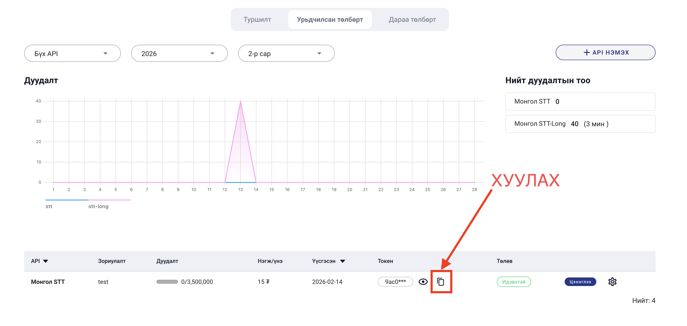

---

### 12. API түлхүүрийг програмд оруулах

MacBook-ийн дээд status bar дээрх микрофон дүрс дээр дарж, **"Тохиргоо..."** сонголтыг нээнэ. **Chimege API Token** талбарт хуулсан API түлхүүрийг оруулна.

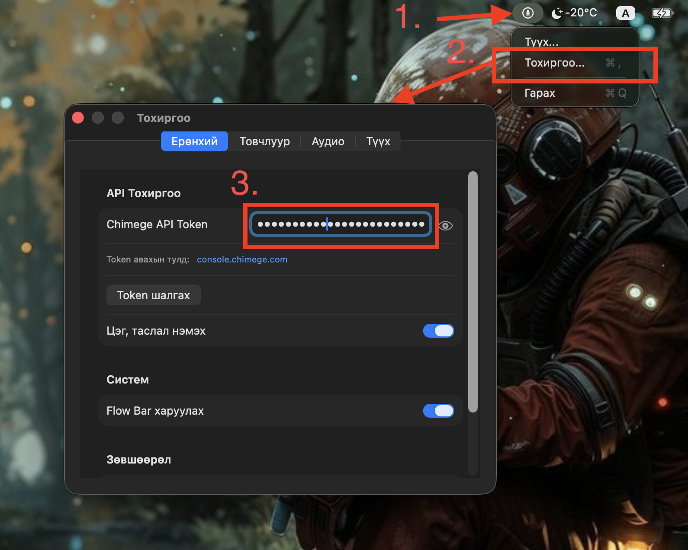

---

### 13. Accessibility зөвшөөрөл нээх

Тохиргоо цонхны доод хэсэгт байрлах **Зөвшөөрөл** хэсгээс Accessibility-ийн хажууд байгаа **"Нээх (+ дарж нэмнэ үү)"** товчийг дарна.

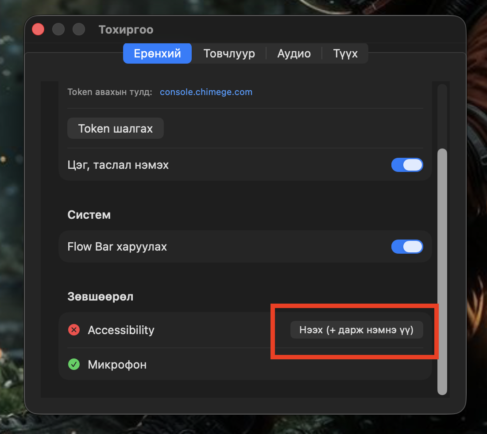

---

### 14. Accessibility зөвшөөрөл идэвхжүүлэх

System Settings-ийн Accessibility хэсэг нээгдэнэ. Жагсаалтаас **DuudlagaFlow**-г олоод, хажууд байгаа товчийг идэвхжүүлнэ (асаана).

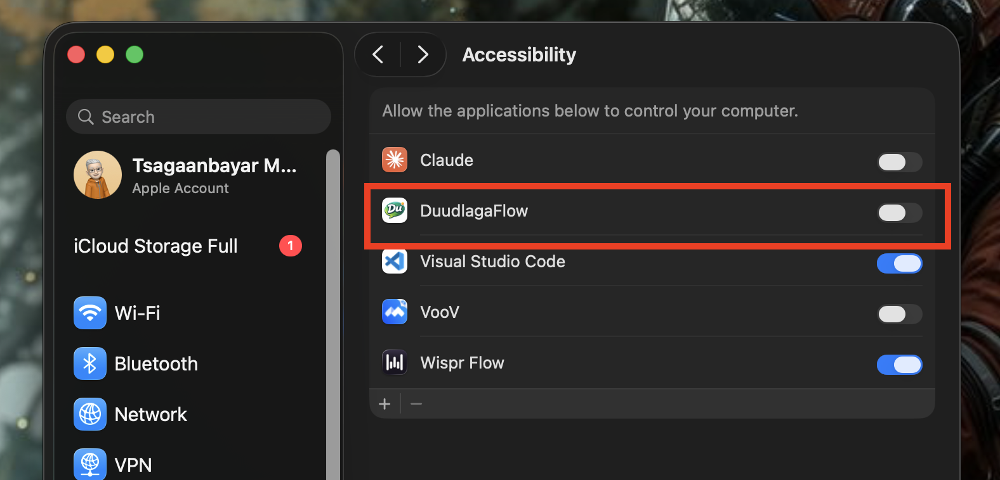

---

### 15. Програмыг дахин нээх

Status bar дээрх микрофон дүрс дээр дараад **"Гарах"** товчийг дарж програмыг хаана. Дараа нь DuudlagaFlow програмыг дахин нээнэ.

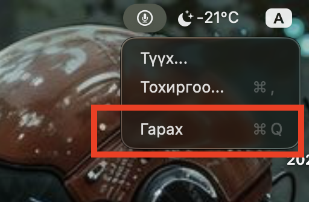

---

### 16. Ашиглах

Бүх тохиргоо дууссан! Хүссэн үедээ `Control + Option` товчлуурыг зэрэг дарж яриагаа бичвэрт хөрвүүлж эхлээрэй. Таньд амжилт хүсье!
